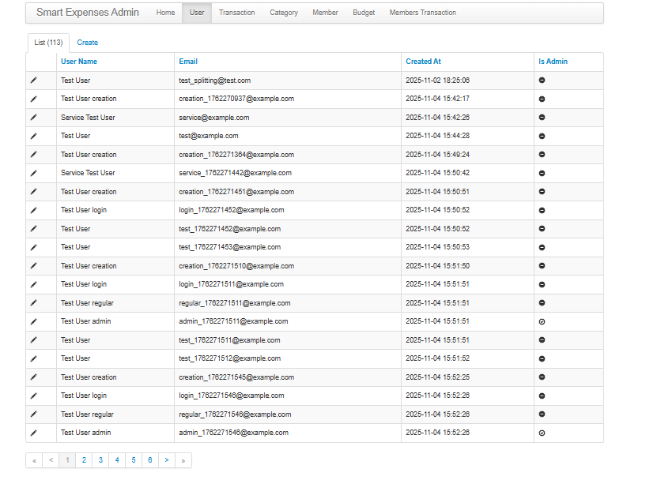
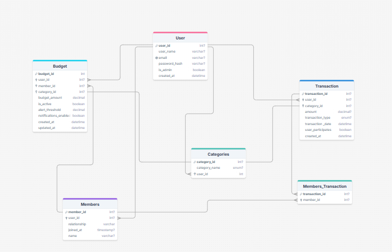
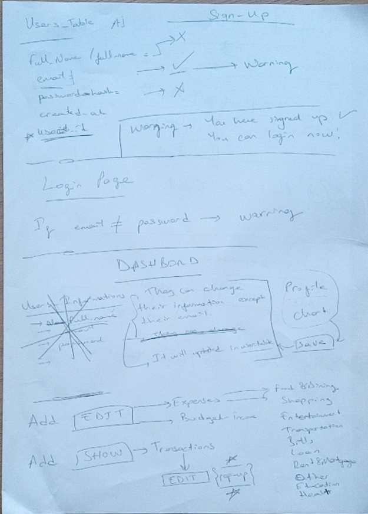
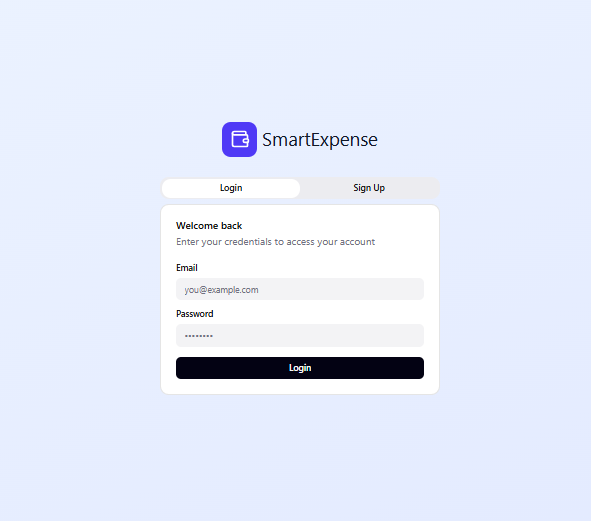

# Smart Expenses Tracker

## 🎥 Demo Video

<video src="docs/images/Recording live.mp4" controls width="800">
  Your browser does not support the video tag.
</video>

_Watch the full application walkthrough showing expense tracking, family management, budgets, and analytics features._

---

A comprehensive family expense management web application that enables users to track personal and shared expenses, manage family member contributions, set intelligent budgets, and generate detailed financial reports. The goal was to build something intuitive, simple, and scalable while applying Flask best practices and modern web development principles.

[](https://www.python.org/)
[](https://flask.palletsprojects.com/)
[](https://www.sqlalchemy.org/)
[](tests/)

[Live Demo](#) | [Documentation](PROJECT_DOCUMENTATION.md) | [Report Bug](https://github.com/FlaviaMorgulis/Smart_Expenses_Tracker/issues) | [Request Feature](https://github.com/FlaviaMorgulis/Smart_Expenses_Tracker/issues)

---

## Table of Contents

- [Project Goals](#-project-goals)
- [User Stories](#-user-stories)
- [Features](#-features)
- [Database Design](#-database-design)
- [User Interface](#-user-interface)
- [Technology Stack](#-technology-stack)
- [Project Management](#-project-management)
- [Installation](#-installation)
- [Testing](#-testing)
- [Deployment](#-deployment)
- [Future Enhancements](#-future-enhancements)
- [Credits](#-credits)

---

## Project Goals

- **Intuitive Financial Management** - User-friendly expense tracking for individuals and families
- **Intelligent Cost Splitting** - Flexible splitting: personal, shared, or members-only expenses
- **Real-Time Budget Monitoring** - Proactive alerts and spending analysis with custom thresholds
- **Actionable Financial Insights** - Interactive dashboards, trends, and detailed reports
- **Data Privacy & Security** - Secure authentication and authorization
- **Scalability** - Maintainable Flask Blueprint architecture for future expansion

---

## User Stories

### 1. Expense Tracking and Budget Management

**As a budget-conscious user**, I want to quickly log daily expenses, categorize them, set monthly budgets, and receive alerts when approaching limits, **so that** I can maintain control over my finances.

### 2. Family Expense Sharing

**As a family account manager**, I want to add family members, assign them to shared expenses, and view detailed breakdowns, **so that** I can fairly distribute household costs and maintain transparency.

### 3. Financial Analysis and Reporting

**As a detail-oriented user**, I want to view monthly summaries, analyze spending patterns, and export data to CSV/PDF, **so that** I can identify trends and maintain accurate records.

### 4. Account and Data Management

**As a privacy-conscious user**, I want to create a secure account, update my profile, and delete my data when needed, **so that** I can maintain control over my personal information.

### 5. Administrative Oversight

**As a system administrator**, I want to access an admin interface to manage users, transactions, and categories, **so that** I can maintain the application and ensure system integrity.

---

## Features

### Main Application Features

Core features for personal and family expense management with intelligent cost splitting.

#### User Authentication

Secure email-based registration and login with bcrypt password hashing, session management, and role-based admin access control.

#### Interactive Dashboard

Real-time financial overview with monthly summaries, category pie charts, budget progress bars with color-coded alerts, spending trends, and recent transaction activity.

#### Transaction Management

Complete CRUD operations for income/expenses with category assignment, date selection, member cost-splitting, and user participation toggle. Advanced filtering by type, category, and date range with sorting and pagination.

#### Family Member Management

Add, edit, and delete family members with automatic join date tracking. View comprehensive member statistics including total contributions, transaction count, and spending averages.

#### Intelligent Cost Splitting

Flexible expense splitting with three modes: personal (100% user), shared (even split with members), and members-only (user pays, members owe). Real-time calculations with clear cost breakdowns.

See [PROJECT_DOCUMENTATION.md](PROJECT_DOCUMENTATION.md#cost-splitting-system) for detailed calculations and examples.

#### Budget Management

Create budgets for users or members by category or total spending. Real-time monitoring with color-coded alerts (🟢 green, 🟡 yellow, 🟠 orange, 🔴 red) based on customizable thresholds (default 80%). Pause/unpause budgets as needed.

#### Data Export

Export transactions to CSV (Excel/Google Sheets compatible) or PDF (professional formatted reports) for tax preparation and record-keeping.

#### User Profile Management

View and edit account details (username, email). Clear all transaction data or permanently delete account with double confirmation for data safety.

#### Cash Flow Analysis

Visualize income vs expenses with line charts, category breakdowns, net balance tracking, and spending trend predictions.

#### Admin Interface

Flask-Admin dashboard for superusers with full database management: user/transaction/category/budget oversight, bulk operations, and advanced search/filtering.



### Additional Features

- **Search & Filtering** - Transaction search by amount, date, category; member filtering; date range pickers
- **Responsive Design** - Mobile-first approach with CSS Grid/Flexbox, optimized for all screen sizes
- **Real-Time Updates** - Instant budget recalculation, live spending percentages, dynamic statistics

---

## Database Design



_Entity Relationship Diagram showing all 6 tables with fields, data types, nullable constraints, and relationship cardinalities_

The application uses 6 core tables managed by SQLAlchemy ORM with Flask-Migrate for migrations:

- **Users** - Account authentication and profiles
- **Categories** - 7 system categories (Transport, Utilities, Entertainment, Food, Healthcare, Shopping, Other) + custom
- **Members** - Family member data entities (not user accounts)
- **Transactions** - Income/expense financial records
- **MembersTransaction** - Junction table for cost splitting (many-to-many)
- **Budgets** - Budget tracking for users/members by category

**Database**: SQLite (development) / PostgreSQL (production-ready)

For implementation details and key relationship notes, see [Project Documentation](PROJECT_DOCUMENTATION.md#database-design).

---

## User Interface

### Design Principles

- **User-Centered**: Clean interfaces, intuitive navigation, consistent design patterns
- **Responsive**: Mobile-first with breakpoints (Desktop: 1200px+, Tablet: 768-1199px, Mobile: <768px)
- **Accessible**: Semantic HTML5, ARIA labels, keyboard navigation, WCAG AA compliant

### Design Process

**Wireframing**: Initial paper sketches to establish layout and user flow  
**Prototyping**: High-fidelity mockups created in Figma for visual design

<table>
<tr>
<td width="50%" align="center">

<p><em>Paper Wireframes</em></p>
</td>
<td width="50%" align="center">
<a href="https://sleet-thread-13810139.figma.site/" target="_blank" rel="noopener noreferrer">

</a>
<p><em>Click to view interactive Figma prototype</em></p>
</td>
</tr>
</table>

### Color Palette

- 🟦 **Primary Blue** `#3498db` - Main actions, links, primary buttons
- 🟩 **Success Green** `#28a745` - Confirmations, positive feedback, income
- 🟨 **Warning Yellow** `#ffc107` - Alerts, budget warnings
- 🟥 **Danger Red** `#dc3545` - Errors, deletions, over-budget status
- ⬛ **Dark Gray** `#2c3e50` - Text, headers
- ⬜ **Light Gray** `#f8f9fa` - Backgrounds, borders

### Typography

- **Font Family**: System font stack (Arial, Helvetica, sans-serif)
- **Headings**: Bold weight for hierarchy
- **Body Text**: Regular weight for readability
- **Font Sizes**: Responsive scaling for accessibility

### Pages

**Public Routes**: Landing (`/`), Login, Register, About, FAQ  
**Protected Routes**: Dashboard, Transactions, Family Management, Budgets, Cash Flow, Profile  
**Admin Only**: Admin Dashboard (`/admin`)

Full route details and access control logic available in [Project Documentation](PROJECT_DOCUMENTATION.md#api-endpoints).

### Navigation & Security

**Flask Blueprint Structure**:

- `auth_bp` - Login, signup, logout
- `main_bp` - Dashboard, family, profile, cashflow, static pages
- `transactions_bp` - Transactions CRUD, budgets, exports

**Defensive Design**: Form validation (client + server), CSRF protection, SQL injection prevention, XSS protection, bcrypt password hashing, confirmation dialogs for destructive actions

---

## Technology Stack

**Backend**: Flask 3.1.2, Python 3.13, SQLAlchemy 2.0.36, Flask-Login, Flask-WTF, ReportLab (PDF), bcrypt (password hashing)  
**Database**: SQLite (development) / PostgreSQL (production) with Flask-Migrate  
**Frontend**: HTML5, CSS3 (Grid/Flexbox), Vanilla JavaScript  
**Testing**: pytest 8.4.2, pytest-flask, 49 tests (100% passing)  
**Tools**: Git/GitHub, VS Code, pip, venv

See `requirements.txt` for complete dependency list.

### Flask Application Structure

```
Smart_Expenses_Tracker/
├── run.py                      # Application entry point
├── requirements.txt            # Python dependencies
├── app/
│   ├── __init__.py            # App factory, extensions initialization
│   ├── models.py              # SQLAlchemy models (User, Transaction, Member, Budget, Category)
│   ├── services.py            # Business logic (cost splitting, budget calculations)
│   ├── utils.py               # Helper functions
│   ├── admin.py               # Admin user management
│   ├── auth/                  # Authentication blueprint
│   │   ├── __init__.py
│   │   ├── routes.py          # Login, register, logout routes
│   │   └── forms.py           # WTForms for authentication
│   ├── main/                  # Main application blueprint
│   │   ├── __init__.py
│   │   └── routes.py          # Dashboard, profile routes
│   ├── transactions/          # Transaction management blueprint
│   │   ├── __init__.py
│   │   ├── routes.py          # CRUD operations for transactions
│   │   └── forms.py           # Transaction forms
│   ├── static/
│   │   ├── css/               # Stylesheets (style.css, budget.css, etc.)
│   │   ├── js/                # JavaScript files (script.js, members.js)
│   │   └── images/            # Static images
│   ├── templates/             # Jinja2 templates
│   │   ├── base.html          # Base template with navigation
│   │   ├── index.html         # Landing page
│   │   ├── dashboard.html     # Main dashboard
│   │   ├── transactions.html  # Transaction list
│   │   ├── edit_transaction.html # Edit transaction form
│   │   ├── budget.html        # Budget management
│   │   ├── family_management.html # Family members
│   │   ├── cashflow.html      # Cash flow analysis
│   │   ├── about.html         # About page
│   │   └── faq.html           # FAQ page
│   └── utilities/
│       └── seed_categories.py # Database seeding script
├── migrations/                 # Flask-Migrate database migrations
├── instance/
│   └── expenses.db            # SQLite database (dev)
└── tests/                     # pytest test suite
    ├── conftest.py            # Test fixtures
    ├── test_auth.py           # Authentication tests
    ├── test_family_management.py # Family management tests
    ├── test_transactions.py   # Transaction tests
    ├── test_budgets.py        # Budget tests
    └── test_cost_splitting.py # Cost splitting logic tests
```

---

## Project Management

**Development Approach**: Hybrid methodology combining Waterfall and Agile practices

### Waterfall Phase (Planning & Design)

- **Ideation**: Requirements gathering and feature planning
- **Design**: Wireframing (paper sketches) and prototyping (Figma)
- **Database Design**: ERD modeling and schema planning

### Agile Phase (Development & Deployment)

- **Methodology**: Iterative development with sprint cycles
- **Task Management**: [GitHub Projects](https://github.com/users/FlaviaMorgulis/projects/1) with Kanban board
- **Version Control**: Git feature branches and pull requests
- **Testing**: Continuous testing and integration

**Tools**: [GitHub Projects](https://github.com/users/FlaviaMorgulis/projects/1) for task tracking, Git/GitHub for version control and collaboration

---

## Installation

```bash
# 1. Clone repository
git clone https://github.com/FlaviaMorgulis/Smart_Expenses_Tracker.git
cd Smart_Expenses_Tracker

# 2. Create virtual environment
python -m venv venv
venv\Scripts\activate  # Windows
# source venv/bin/activate  # macOS/Linux

# 3. Install dependencies
pip install -r requirements.txt

# 4. Initialize database
flask db upgrade

# 5. Seed categories (run in Python shell)
python -c "from app import create_app, db; from app.utilities.seed_categories import seed_system_categories; app = create_app(); app.app_context().push(); seed_system_categories()"

# 6. Create admin user (optional)
python create_admin.py

# 7. Run application
python run.py
# Access at http://127.0.0.1:5000
```

**Requirements**: Python 3.10+, pip, git (optional)

---

## Testing

**Test Suite**: 49 tests (100% passing) - Authentication (15), Transactions (6), Family Management (8), Cost Splitting (10), Budget Management (10)

**Test Strategy**: Test-Driven Development (TDD) approach with isolated unit and integration tests. Each test uses in-memory SQLite database to ensure no state pollution. Comprehensive coverage of authentication, CRUD operations, cost-splitting logic, and budget calculations.

```bash
pytest                  # Run all tests
pytest --cov=app        # With coverage
pytest tests/test_auth.py  # Specific file
```

Full test documentation in [Project Documentation](PROJECT_DOCUMENTATION.md#testing).

---

## Deployment

**Status:** Development Complete - Ready for Deployment

**Next Phase:** Production deployment and user testing planned for PythonAnywhere platform.

---

## Future Enhancements

- [ ] **Cashflow for Family Management** - Per-member cash flow analysis and tracking
- [ ] **Enhanced Analytics** - Year-over-year comparison, trend predictions, spending heatmaps, forecasting
- [ ] **Notifications** - Email/SMS budget alerts, in-app notification center, summary emails
- [ ] **Advanced Budgets** - Weekly/monthly/yearly periods, recurring budgets, rollover, templates
- [ ] **Receipt Scanning** - Mobile camera OCR, auto-populate transactions, cloud storage
- [ ] **Data Visualization** - Interactive charts (Chart.js/D3.js), customizable widgets, drag-and-drop
- [ ] **Multi-Currency** - Currency conversion API, exchange rate tracking, multiple currencies
- [ ] **Recurring Transactions** - Subscription tracking, auto-create expenses, bill reminders
- [ ] **Mobile App** - React Native (iOS/Android), offline sync, push notifications, biometrics
- [ ] **Shared Accounts** - Multi-user access, role-based permissions, real-time collaboration
- [ ] **Advanced Reporting** - Tax reports, custom builder, scheduled delivery, accounting exports
- [ ] **Banking Integration** - Plaid/Open Banking API, auto-import, credit card sync, net worth
- [ ] **Machine Learning** - Pattern recognition, anomaly detection, smart suggestions, predictive alerts
- [ ] **Goal Setting** - Savings tracker, debt payoff calculator, milestone tracking, visual progress

---

## Credits

**Developers**: [Flavia Morgulis](https://github.com/FlaviaMorgulis) | [Behram Aras](https://github.com/behramaras)

**Acknowledgments**:[Komal Karrir](https://github.com/Komals-Code4All) (Instructor), Flask documentation, SQLAlchemy ORM, pytest team, Stack Overflow community, [RealPython](https://realpython.com/)

**Resources**: [Project Documentation](PROJECT_DOCUMENTATION.md) | [Flask Docs](https://flask.palletsprojects.com/) | [SQLAlchemy Docs](https://docs.sqlalchemy.org/) | [pytest Docs](https://docs.pytest.org/) | [RealPython](https://realpython.com/) | [CS50](https://cs50.harvard.edu/) | [GitHub Docs](https://docs.github.com/) | [GitHub Projects](https://docs.github.com/en/issues/planning-and-tracking-with-projects)

**Support**: [Report Bug](https://github.com/FlaviaMorgulis/Smart_Expenses_Tracker/issues) | [Request Feature](https://github.com/FlaviaMorgulis/Smart_Expenses_Tracker/issues)

---

<div align="center">

**[⬆ Back to Top](#smart-expenses-tracker)**

Made by Flavia Morgulis & Behram Aras

© 2025 Smart Expenses Tracker.

</div>
